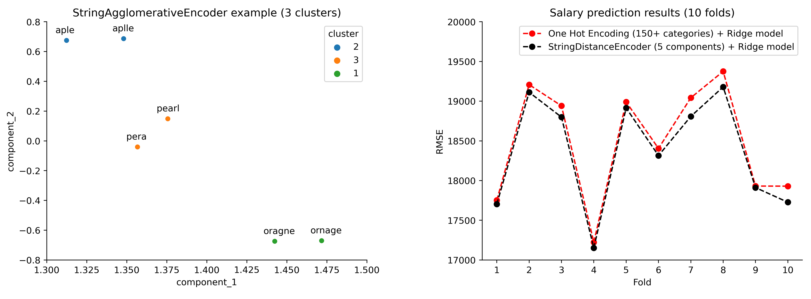

<!-- ABOUT THE PROJECT -->
## About The Project
<p align="center">
  
</p>

Inspired by the methodology exposed in the article ["Similarity encoding for learning with dirty categorical variables"](https://link.springer.com/article/10.1007/s10994-018-5724-2), I wrote two Python classes **compatible with scikit-learn** capable of dealing with "dirty categories", which are categories with typos or a complex, implicit hierarchy.

"Dirty categories" are a huge challenge in the data cleaning and modeling stages and, in the latter context, can be extremely harmful in terms of the cardinality of the categories when using methods such as One Hot Encoding. In that regard:

- The `StringAgglomerativeEncoder` class **clusters similar "dirty categories"** and, thus, **can serve to speed up and automate the data cleaning process**. To work, the class vectorizes unique categories using the n-gram technique and calculates the distance between each vector using the Dice metric. With the distance matrix, the Hierarchical Clustering method is applied.

- The `StringDistanceEncoder` class, instead of calculating the distance matrix, uses the n-gram vectors representing each category to **extract components by the Singular Value Decomposition (SVD) method**, which is commonly employed as a dimensionality reduction method in the context of machine learning. If two components are extracted in total, it is possible to project the "dirty categories" on a plot and thus **visualize the distance between them**!

<p align="right">(<a href="#readme-top">back to top</a>)</p>

<!-- GETTING STARTED -->
## Getting Started

You can start making use of the classes by downloading the `.py` files (`StringAgglomerativeEncoder.py` and `StringDistanceEncoder.py`) and then moving them in your working directory. Then just import the classes as follows:

```python 
from StringAgglomerativeEncoder import StringAgglomerativeEncoder
```

or...

```python 
from StringDistanceEncoder import StringDistanceEncoder
```

<!-- USAGE EXAMPLES -->
## Usage

You can find examples of how to properly use the classes in this repository by accessing the example notebooks.

- The `prediction_example.ipynb` notebook exemplifies the use of the `StringDistanceEncoder` class for prediction problems and compares the performance of this method with what would be obtained using the `OneHotEncoder` class.
- The notebook in `visualization_and_clustering_example.ipynb` exemplifies the use of the `StringAgglomerativeEncoder` class for clustering categories with typos. Then, the clusters are visualized in a two-dimensional space through the use of the `StringDistanceEncoder` class.

<p align="right">(<a href="#readme-top">back to top</a>)</p>

<!-- CONTRIBUTING -->
## Contributing

Contributions are what make the open source community such an amazing place to learn, inspire, and create. Any contributions you make are **greatly appreciated**.

If you have a suggestion that would make this project better, please fork the repo and create a pull request. You can also simply open an issue with the tag "enhancement".
Don't forget to give the project a star! **Thanks!**

<p align="right">(<a href="#readme-top">back to top</a>)</p>

<!-- LICENSE -->
## License

Distributed under the MIT License. See `LICENSE.txt` for more information.

<p align="right">(<a href="#readme-top">back to top</a>)</p>

<!-- CONTACT -->
## Contact

Carlos Eduardo Gonçalves de Oliveira - [linkedin](https://www.linkedin.com/in/cego669/) - carlosedgonc@gmail.com

Project Link: [https://github.com/cego669/DirtyCategoriesEncoding](https://github.com/cego669/DirtyCategoriesEncoding)

<p align="right">(<a href="#readme-top">back to top</a>)</p>

