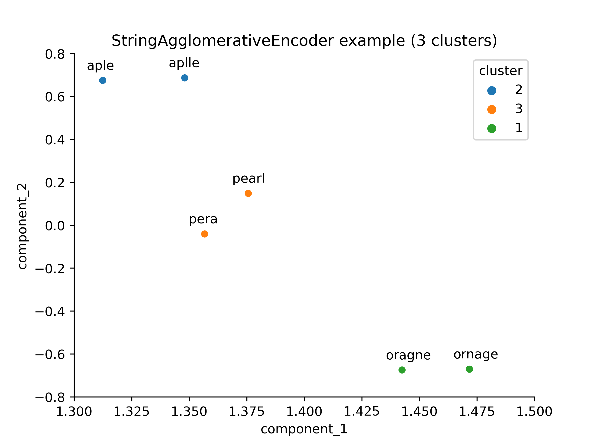

<!-- ABOUT THE PROJECT -->
## About The Project
<p align="center">
  
</p>

Inspired by the article ["Similarity encoding for learning with dirty categorical variables"](https://arxiv.org/abs/1806.00979), I decided to create classes capable of clustering dirty categories and also reducing the dimensionality of dirty categories through the use of the `CountVectorizer` (n-gram character vectorization) and `TruncatedSVD` (dimensionality reduction method similar to Principal Component Analysis, but more appropriate for sparse matrices). The classes present in this project, that is, `StringAgglomerativeEncoder` and `StringDistanceEncoder` are **compatible with the `scikit-learn` API**, so they can be easily implemented and integrated into complex machine learning pipelines.

- The `StringAgglomerativeEncoder` can be used to **group dirty categories**, so it can serve **to assist and speed up automatic category cleaning processes**.
- The `StringDistanceEncoder` class **projects the distance between the categories** found in the training data into a space of components extracted by `TruncatedSVD`, serving as **an alternative to the One Hot Encoding** method in prediction problems. It can also serve for **visualization purposes** and **exploratory analysis**.

<p align="right">(<a href="#readme-top">back to top</a>)</p>

<!-- GETTING STARTED -->
## Getting Started

You can start making use of the classes by downloading the `.py` files (`StringAgglomerativeEncoder.py` and `StringDistanceEncoder.py`) and then moving them in your working directory. Then just import the classes as follows:

```python 
from StringAgglomerativeEncoder import StringAgglomerativeEncoder
```

or...

```python 
from StringDistanceEncoder import StringDistanceEncoder
```

<!-- USAGE EXAMPLES -->
## Usage

Você pode encontrar exemplos de como utilizar devidamente as classes deste repositório acessando aos notebooks de exemplo.

- The `prediction_example.ipynb` notebook exemplifies the use of the `StringDistanceEncoder` class for prediction problems and compares the performance of this method with what would be obtained using the `OneHotEncoder` class.
- The notebook in `visualization_and_clustering_example.ipynb` exemplifies the use of the `StringAgglomerativeEncoder` class for clustering categories with typos. Then, the clusters are visualized in a two-dimensional space through the use of the `StringDistanceEncoder` class.

<p align="right">(<a href="#readme-top">back to top</a>)</p>

<!-- CONTRIBUTING -->
## Contributing

Contributions are what make the open source community such an amazing place to learn, inspire, and create. Any contributions you make are **greatly appreciated**.

If you have a suggestion that would make this project better, please fork the repo and create a pull request. You can also simply open an issue with the tag "enhancement".
Don't forget to give the project a star! **Thanks!**

<p align="right">(<a href="#readme-top">back to top</a>)</p>

<!-- LICENSE -->
## License

Distributed under the MIT License. See `LICENSE.txt` for more information.

<p align="right">(<a href="#readme-top">back to top</a>)</p>

<!-- CONTACT -->
## Contact

Carlos Eduardo Gonçalves de Oliveira - [linkedin](https://www.linkedin.com/in/cego669/) - carlosedgonc@gmail.com

Project Link: [https://github.com/cego669/DirtyCategoriesEncoding](https://github.com/cego669/DirtyCategoriesEncoding)

<p align="right">(<a href="#readme-top">back to top</a>)</p>

